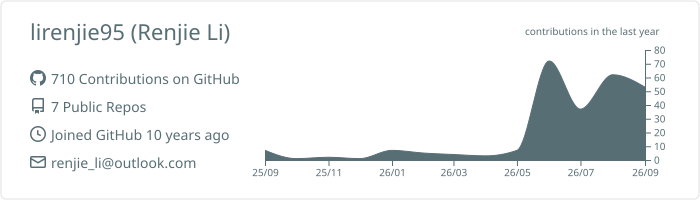
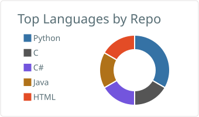
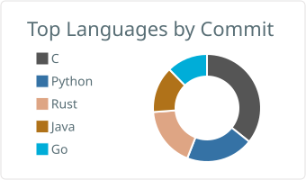
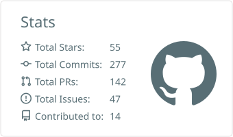
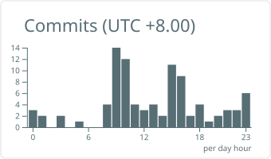

# Hi there, I'm Renjie Li 👋

## Writing

- [Refactoring rust2go: One Month, Twenty Small PRs](https://lirenjie95.github.io/posts/rust2go-refactor.html) — a retrospective on a month-long, twenty-PR refactor of rust2go.

## Stats

<picture>
  <source media="(prefers-color-scheme: dark)" srcset="dist/github-contribution-grid-snake-dark.svg" />
  
</picture>
