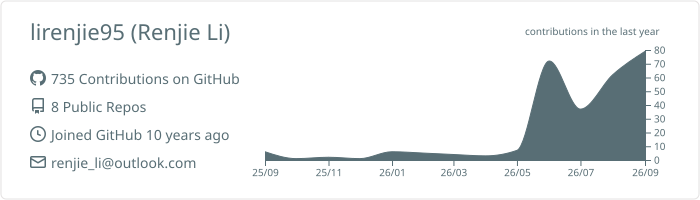
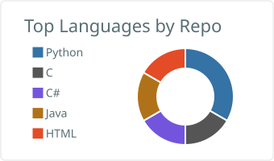
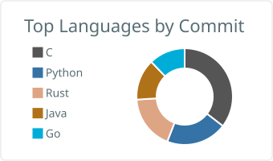
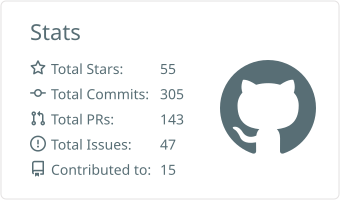
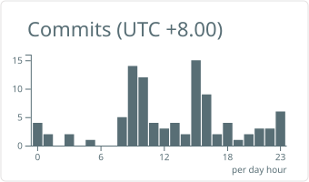

# Hi there, I'm Renjie Li 👋

## Writing

- [Refactoring rust2go: One Month, Twenty Small PRs](https://lirenjie95.github.io/posts/rust2go-refactor.html) — a retrospective on a month-long, twenty-PR refactor of rust2go.
- [Mi Home Scene Lab](https://lirenjie95.github.io/mihome-scene-lab/) — a browser-based lab for Xiaomi Mi Home automation scene backups (.bak): visualize, simulate, edit, and AI-generate scenes, fully local. ([repo](https://github.com/lirenjie95/mihome-scene-lab))
- [No Code? No Problem. — Contributing to open source through p5.js Chinese translation](https://lirenjie95.github.io/pcd2026-talk/) — a PCD 2026 talk.

<h2>Stats</h2>

<table align="center">
  <tr>
    <td></td>
    <td></td>
  </tr>
</table>

<table align="center">
  <tr>
    <td></td>
    <td></td>
    <td></td>
    <td></td>
  </tr>
</table>

  <picture>
    <source media="(prefers-color-scheme: dark)" srcset="dist/github-contribution-grid-snake-dark.svg" />
    
  </picture>

